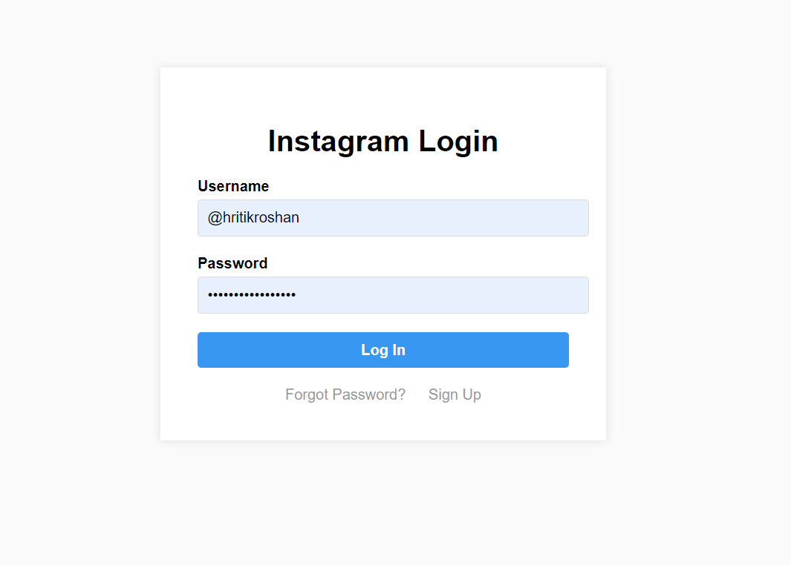
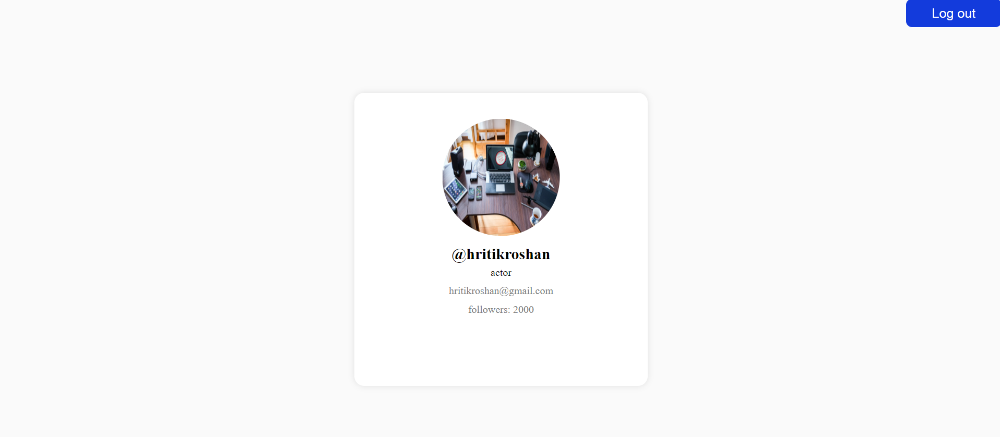

# Express Authentication(Instagram User Page)
It is basic user authentication app
It has signup, signin and user page

## Client side Images

### Signup Page


### Login Page


### User Page



##  Backend features
- MongoDb Atlas used for database system
- Packages (bcrypt, cookie-parser, cors, dotenv, email-validator, express, jsonwebtoken, mongoose nodemon)
- middleware for validation and authetication
- Routes request 
('/signup') for signup,
('/login') for login,
('/') for getuser 
('/logout') for logout;


## Backend API 

### About API


#### sign up in app
- It is post request.
- It takes name, username, bio, email, password from user and save it to the database.
- saves password using bcrypt that makes it secure.
```
  http://localhost:${env_port}/signup
```

#### login in app
- It is post request 
- It takes  username, password from user and verify it with data from database
- If request is successful then create token (using jsonWebToken) for verification for GET request

```
  http://localhost:${env_port}/login
```
#### get user in app
- It is get request 
- It validates token and get data from it 
- If request is successful then fetch data from it 

```
  http://localhost:${env_port}/
```
#### logout in app
- It is get request 
- It validates token 
- If request is successful then delete token

```
  http://localhost:${env_port}/logout
```


## Installation

### Note
You need to setup your personal requirements in .env file
```
PORT (for backend)
MONGODB_URL (database url)
SECRET (secret key for bcrypt application)
CLIENT_URL (frontend url);
```

```
# Clone this repository
$ git clone https://github.com/SuhasMarade/Auth_with_Express.git

# Go into the repository
$ cd Auth_with_Express.git/backend

# Install dependencies
$ npm install

# Run backend app
$ npm run dev

# then open new terminal (We need to keep backend server running)
$ cd Auth_with_Express.git/client

# then start index.html file
$ open index.html
```